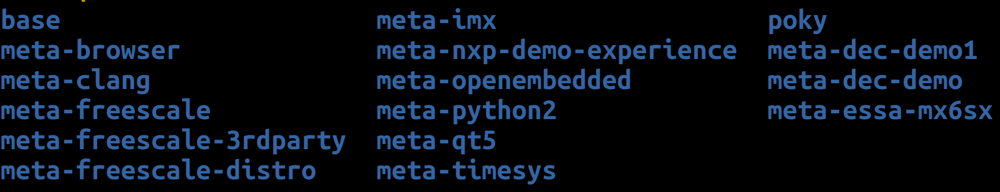
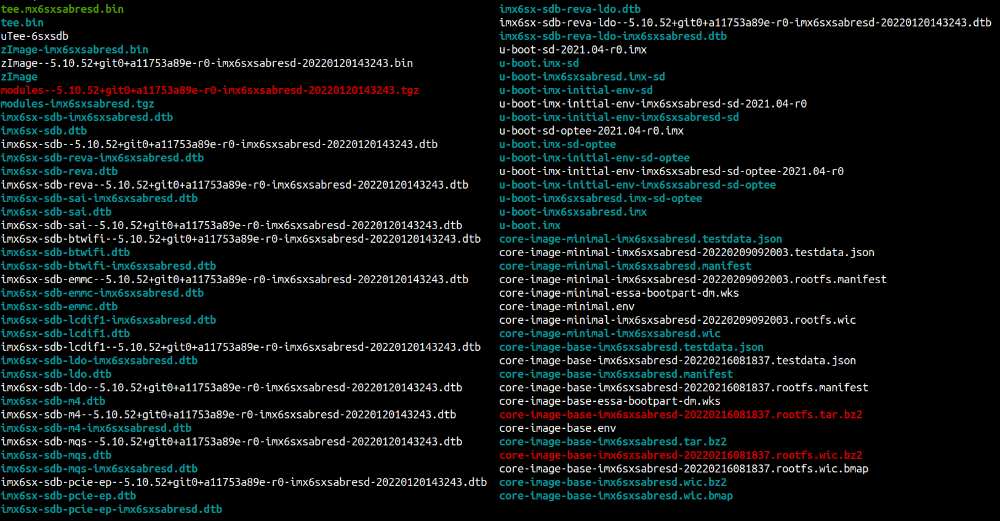
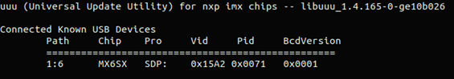
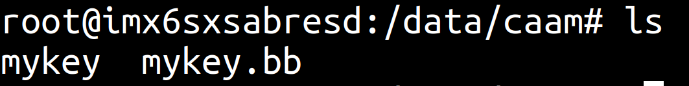
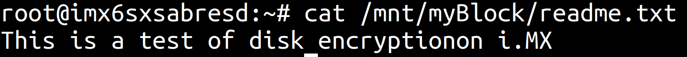

<!--
# File: Quick_Start_Guide.md
# Copyright (c) 2022 BG Networks, Inc.
# See LICENSE file for license details.
-->

<p align="center">
    
</p>

# 1. Introduction

[BG Networks](https://bgnet.works/)' Embedded Security Software Architecture ([ESSA](https://bgnet.works/security-automation-tools-overview/embedded-security-software-architecture/)) enhances cybersecurity for IoT devices, including secure boot, encryption, authentication, and secure software updates. The ESSA enables engineers to extend a hardware root of trust to secure U-Boot, the Linux kernel, and applications in the root file system. This document will guide the user on implementing BG Network’s ESSA on a [NXP’s i.MX6 SoloX SABRE EVK](shttps://www.nxp.com/imx6sxsabre) board (`imx6sxsabresd`).

# 2. Setup

The following packages are needed to build an image on a headless system. The build has been tested with `Ubuntu 20.04 (LTS)`.

```bash
sudo apt install -y gawk wget git diffstat unzip texinfo gcc build-essential \
chrpath socat cpio python3 python3-pip python3-pexpect xz-utils debianutils \
iputils-ping python3-git python3-jinja2 libegl1-mesa libsdl1.2-dev pylint3 \
xterm python3-subunit mesa-common-dev zstd liblz4-tool snapd minicom

# Downloading and installing repo tool
curl https://storage.googleapis.com/git-repo-downloads/repo ~/repo
chmod a+x ~/repo
sudo cp ~/repo /usr/bin
```

For other supported Linux distributions, please refer to the [Yocto Project Reference Manual](https://www.yoctoproject.org/docs/current/ref-manual/ref-manual.html#detailed-supported-distros).

# 2. Yocto build

The following outlines the steps needed build the core image using Yocto with BGN-ESSA.

Create directory for the ESSA BSP for the iMX6SX SABRE EVK board:

```bash
mkdir ~/meta-bgn-essa-mx6sx
cd ~/meta-bgn-essa-mx6sx
```

Initialize and sync repository:

```bash
# Initiating NXP BSP
repo init -u git://source.codeaurora.org/external/imx/imx-manifest.git -b imx-linux-honister -m imx-5.15.5-1.0.0.xml

# Download ESSA manifest
wget --directory-prefix .repo/manifests https://raw.githubusercontent.com/bgnetworks/meta-essa-mx6sx/honister/scripts/imx-5.15.5-1.0.0-bgn-essa.xml
repo init -m imx-5.15.5-1.0.0-bgn-essa.xml

repo sync -j$(nproc)
```

The following files and directories are located in the `meta-essa-mx6sx` directory:

<p align="left">
    
</p>

The Yocto meta directories are located in the `sources` directory:

<p align="left">
    
</p>

Setup the build environment:

```bash
MACHINE=imx6sxsabresd DISTRO=fsl-imx-fb source mx6sx-setup-essa.sh -b build
```

Build the core image:

```bash
bitbake core-image-base
```

**Note**: _The initial image build might take a few hours_

# 4. Program the image into the board SD-card

Install uuu tool:

```bash
sudo snap install universal-update-utility
```

Change to the image directory:

```bash
cd ~/meta-bgn-essa-mx6sx/build/tmp/deploy/images/imx6sxsabresd
```

The following shows all images created in build process. The full image for flash the iMX6SX SABRE EVK board is `core-image-base-imx6sxsabresd.wic.bz2`

<p align="left">
    
</p>

Set the iMX6SX SABRE EVK board to serial download protocol (_SDP_) mode by configuring the boot configuration switches following **Table 1**.

| **MODE** | **SW10** | **SW11** | **SW12** |
| :------: | :------: | :------: | :------: |
| **SDP**  | 00000000 | 00000000 | 00000000 |
| **SD4**  | 00000000 | 00111000 | 01000000 |
| **QSPI** | 00000000 | 00000000 | 00011000 |

**TABLE 1**: Boot mode selection switches on i.<d/>MX 6SX EVK

---

Connect the board (`J7 - USB OTG connector`) to the build machine with type B-Micro USB cable:

<p float="left">
    
    
</p>

Power up the board and confirm the board has been set up correctly:

```bash
uuu -lsusb
```

<p align="left">
    
</p>

Flash the U-Boot and Yocto OS image:

```bash
uuu -b sd_all u-boot.imx core-image-base-imx6sxsabresd.wic.bz2
```

Power down the board and set the iMX6SX SABRE EVK board to the SD card (_SD4_) boot mode following **Table 1**

# 5. Connect to device as log in as `root` user

Setup [minicom](https://wiki.emacinc.com/wiki/Getting_Started_With_Minicom) to configure serial communication:

```bash
sudo minicom -s
```

<p float="left">
    
    
    
</p>

Open minicom:

```bash
sudo minicom
```

Connect to the `iMX6SX SABRE EVK` board `J16 - Debug PORT 1` with a **USB-UART** cable.
Power up the iMX6SX SABRE EVK board and log in as: `root`

# 6. Block encryption example: Creating an encrypted block device

An encrypted device can be created using a black key mechanism supported by the i.MX6SX. A black key is a secure key that can only be read back in an encrypted form. The following outlines steps to create an encrypted device, mount the device to the filesystem, add a file that is automatically encrypted, and access the encrypted device after rebooting.

Create black key and key blob using i.MX6SX’s CAAM:

```bash
caam-keygen create mykey ecb -s 16
```

Change to the keyblob directory:
By default, the keys and blobs are created in **KEYBLOB_LOCATION**, which is in the `/data/caam/` folder.

```bash
cd /data/caam
```

The keyblob directory contains two files: `mykey` and `mykey.bb`.

<p align="left">
    
</p>

- `mykey` is a **black key**, called a Tagged Key, used for encryption during the current session.
- `mykey.bb` is **black key blob**, which is an encrypted form of the black key for encryption between power cycles.

This **black key blob** can be stored off device to ensure access to encrypted filesystem is maintained.

Add the key into the Linux keyring:

```bash
cat mykey | keyctl padd logon mykey1: @s
```

Create a file and link to loop device:

```bash
dd if=/dev/zero of=encrypted.img bs=1M count=32
losetup /dev/loop0 encrypted.img
```

Use the generated random key for block encryption:

```bash
dmsetup -v create myEncryptedBlock --table "0 $(blockdev --getsz /dev/loop0) crypt capi:tk(cbc(aes))-plain :36:logon:mykey1: 0 /dev/loop0 0 1 sector_size:512"
```

Build and mount the encrypted filesystem on the block device:

```bash
mkfs.ext4 /dev/mapper/myEncryptedBlock
mkdir -p /mnt/myBlock
mount /dev/mapper/myEncryptedBlock /mnt/myBlock
```

Test the filesystem by creating new file in the encrypted block:

```bash
echo "This is a test of disk encryption on i.MX" > /mnt/myBlock/readme.txt
```

Unmount and remove the encrypted block device:

```bash
umount /mnt/myBlock
dmsetup remove myEncryptedBlock
```

# 7. Block encryption example: Using an encrypted block device

Reboot the iMX6SX EVK board and log in as: root

Import the block key blob to create the black key used for disk encryption, add the key to the Linux keyring, and use the key for the encrypted block device:

```bash
cd /data/caam
caam-keygen import mykey.bb importKey
cat mykey | keyctl padd logon mykey2: @s

losetup /dev/loop0 encrypted.img

dmsetup -v create myEncryptedBlock --table "0 $(blockdev --getsz /dev/loop0) crypt capi:tk(cbc(aes))-plain :36:logon:mykey2: 0 /dev/loop0 0 1 sector_size:512"
```

Mount the encrypted block:

```bash
mount /dev/mapper/myEncryptedBlock /mnt/myBlock
```

Read from device and verify readme contents:

```bash
cat /mnt/myBlock/readme.txt
```

<p align="left">
    
</p>
