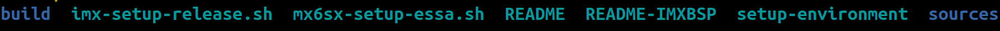

<!--
# File: Quick_Start_Guide.md
# Copyright (c) 2022 BG Networks, Inc.
# See LICENSE file for license details.
-->

<p align="center">
    
</p>

[BG Networks](https://bgnet.works/)' Embedded Security Software Architecture ([ESSA](https://bgnet.works/security-automation-tools-overview/embedded-security-software-architecture/)) is a Yocto-based solution.

# 1. System Requirements

This ESSA layer is for [NXP iMX6SX SABRE EVK](https://www.nxp.com/imx6sxsabre) board (imx6sxsabresd) and tested with `Ubuntu 20.04 (LTS)`.

**Essentials**: The packages that are needed to build an image on a headless system:

```bash
sudo apt install -y gawk wget git diffstat unzip texinfo gcc build-essential \
chrpath socat cpio python3 python3-pip python3-pexpect xz-utils debianutils \
iputils-ping python3-git python3-jinja2 libegl1-mesa libsdl1.2-dev pylint3 \
xterm python3-subunit mesa-common-dev zstd liblz4-tool snapd minicom

# Downloading and installing repo tool
curl https://storage.googleapis.com/git-repo-downloads/repo ~/repo
chmod a+x ~/repo
sudo cp ~/repo /usr/bin
```

For other supported Linux distributions, please refer to the [Yocto Project Reference Manual](https://www.yoctoproject.org/docs/current/ref-manual/ref-manual.html#detailed-supported-distros).

# 2. Yocto build

#### 1. Create a directory for the ESSA BSP for the iMX6SX SABRE EVK board:

```bash
mkdir ~/meta-bgn-essa-mx6sx
cd ~/meta-bgn-essa-mx6sx
```

#### 2. Repository initialization

```bash
repo init -u git://source.codeaurora.org/external/imx/imx-manifest.git -b imx-linux-hardknott -m imx-5.10.52-2.1.0.xml
wget --directory-prefix .repo/manifests https://raw.githubusercontent.com/bgnetworks/meta-essa-mx6sx/hardknott/scripts/imx-5.10.52-2.1.0-bgn-essa.xml
repo init -m imx-5.10.52-2.1.0-bgn-essa.xml
```

#### 3. Pull repositories

```bash
repo sync
```

Files and directories that are in the meta-bgn-essa-mx6sx

<p align="left">
    
</p>

Yocto meta directories that are in the sources

<p align="left">
    
</p>

#### 4. Setup the build environment at first time

```bash
MACHINE=imx6sxsabresd DISTRO=fsl-imx-fb source mx6sx-setup-essa.sh -b build
```

#### 5. Build core image

```bash
bitbake core-image-base
```

The following build configurations should show up in the terminal:

<p align="left">
    
</p>

**Note**: _The initial image build may take a few hours_

# 3. Program the images into the board SD-card

#### 1. Install uuu tool

```bash
sudo snap install universal-update-utility
```

#### 2. Change to the image directory

```bash
cd ~/meta-bgn-essa-mx6sx/build/tmp/deploy/images/imx6sxsabresd
```

<p align="left">
    
</p>

#### 3. Set the `iMX6SX SABRE EVK` board to serial download mode

| **MODE** | **SW10** | **SW11** | **SW12** |
| :------: | :------: | :------: | :------: |
| **SDP**  | 00000000 | 00000000 | 00000000 |
| **SD4**  | 00000000 | 00111000 | 01000000 |
| **QSPI** | 00000000 | 00000000 | 00011000 |

**TABLE 1**: Boot mode selection switches on i.<d/>MX 6SX EVK

#### 4. Connect the board (J7 USB OTG connector) to the build machine with a type B-Micro USB cable

<p align="left">
    
</p>

#### 5. Power up the board

#### 6. Confirm the board has been set up correctly

```bash
uuu -lsusb
```

<p align="left">
    
</p>

#### 7. Burn the uboot and image

```bash
sudo uuu -b emmc_all imx-boot core-image-base-imx6sxsabresd.wic.bz2
```

#### 8. Power down the board

#### 9. Set the `iMX6SX SABRE EVK` board to the `SD-card(SD4)` boot mode

# 4. Block encryption example

#### 1. Set up minicom

```bash
sudo minicom -s
```

<p align="left">
    
</p>

<p align="left">
    
</p>

<p align="left">
    
</p>

#### 2. Open minicom

```bash
sudo minicom
```

#### 3. Connect to the `iMX6SX SABRE EVK` board `J16 - DEBUG PORT 1` with a USB-UART cable

#### 4. Power up the `iMX6SX SABRE EVK` board and log in as `root` after booting is completed

#### 5. Create a random key

```bash
caam-keygen create mykey ecb -s 16
cd /data/caam
```

<p align="left">
    
</p>

#### 6. Add the key into the Linux keyring

```bash
cat mykey | keyctl padd logon mykey1: @s
```

<p align="left">
    
</p>

#### 7. Create a file and link to loop device

```bash
dd if=/dev/zero of=encrypted.img bs=1M count=32
losetup /dev/loop0 encrypted.img
```

#### 8. Use the generated random key for block encryption

```bash
dmsetup -v create myEncryptedBlock --table "0 $(blockdev --getsz /dev/loop0) crypt capi:tk(cbc(aes))-plain :36:logon:mykey1: 0 /dev/loop0 0 1 sector_size:512"
```

<p align="left">
    
</p>

#### 9. Build file system

```bash
mkfs.ext4 /dev/mapper/myEncryptedBlock
```

#### 10. Mount the encrypted block

```bash
mkdir -p /mnt/myBlock
mount /dev/mapper/myEncryptedBlock /mnt/myBlock
```

#### 11. Create a new file in the encrypted block

```bash
echo "This is a test of disk encryption on i.MX" > /mnt/myBlock/readme.txt
```

#### 12. Umount and remove the encrypted block

```bash
umount /mnt/myBlock
dmsetup remove myEncryptedBlock
```

#### 13. Power cycle the `iMX6SX SABRE EVK` board and log in as `root` after the booting is completed

#### 14. Import the generated random key

```bash
cd /data/caam
caam-keygen import mykey.bb importKey
```

<p align="left">
    
</p>

#### 15. Add the key into the Linux keyring

```bash
cat importKey | keyctl padd logon mykey2: @s
```

<p align="left">
    
</p>

#### 16. Link the file to loop device

```bash
losetup /dev/loop0 encrypted.img
```

#### 17. Use the imported key for block encryption

```bash
dmsetup -v create myEncryptedBlock --table "0 $(blockdev --getsz /dev/loop0) crypt capi:tk(cbc(aes))-plain :36:logon:mykey2: 0 /dev/loop0 0 1 sector_size:512"
```

#### 18. Mount the encrypted block

```bash
mount /dev/mapper/myEncryptedBlock /mnt/myBlock
```

#### 19. Check the readme

<p align="left">
    
</p>
